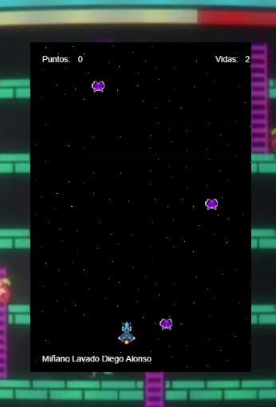

# SpaceInvadersS14

## About

**SpaceInvadersS14** is a vertical defense game developed for the week 14 of the "Interactive Video Game Development" course. This game recreates the classic "Space Invaders" with a unique twist: you need to prevent alien invaders from passing over you. 

The game features:
- **Vertical Gameplay:** Alien invaders descend one by one, and you must stop them from passing over you.
- **Lives:** You have 3 lives. If an alien collides with you or passes above you, you lose a life.
- **Controls:** Gameplay is managed with the mouse and click actions.

### Gameplay Link

- [Play SpaceInvadersS14](https://gatorrante.github.io/SpaceInvadersS14/)

### Screenshot

## Installation and Running

1. **Clone the Repository:**
   - Run `git clone https://github.com/Gatorrante/SpaceInvadersS14.git` to clone the repository.

2. **Navigate to the Project Directory:**
   - `cd SpaceInvadersS14`

3. **Open the Project:**
   - Open the `index.html` file in your browser to play the game.

  
Leer en Español

  # SpaceInvadersS14

  
  
  

  ## Acerca del Proyecto

  **SpaceInvadersS14** es un juego de defensa vertical desarrollado para la semana 14 del curso "Desarrollo de Videojuegos Interactivos". Este juego recrea el clásico "Space Invaders" con un giro único: debes evitar que los alienígenas invasores pasen por encima de ti.

  El juego presenta:
  - **Jugabilidad Vertical:** Los invasores alienígenas descienden uno por uno, y debes detenerlos para que no pasen por encima de ti.
  - **Vidas:** Tienes 3 vidas. Si un alienígena choca contigo o pasa por encima de ti, pierdes una vida.
  - **Controles:** La jugabilidad se maneja con el mouse y clics.

  ### Enlace al Juego

  - [Jugar SpaceInvadersS14](https://gatorrante.github.io/SpaceInvadersS14/)

  ### Captura de Pantalla

  

  ## Instalación y Ejecución

  1. **Clonar el Repositorio:**
     - Ejecuta `git clone https://github.com/Gatorrante/SpaceInvadersS14.git` para clonar el repositorio.

  2. **Navegar a la Carpeta del Proyecto:**
     - `cd SpaceInvadersS14`

  3. **Abrir el Proyecto:**
     - Abre el archivo `index.html` en tu navegador para jugar el juego.

